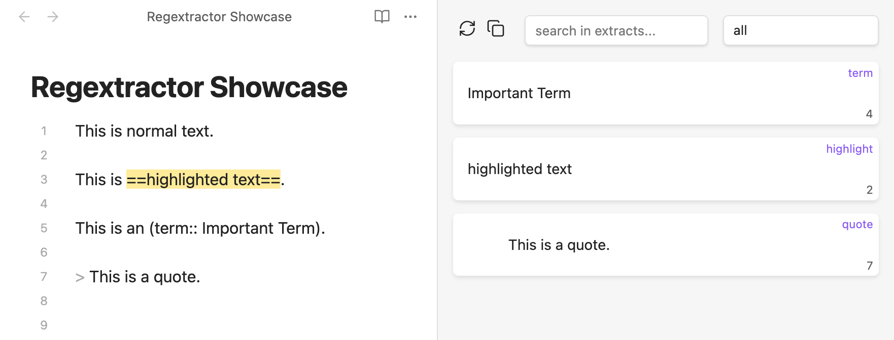
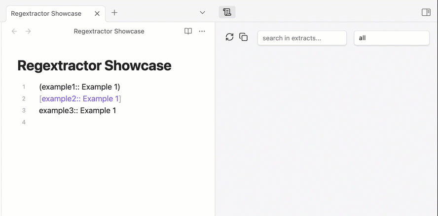
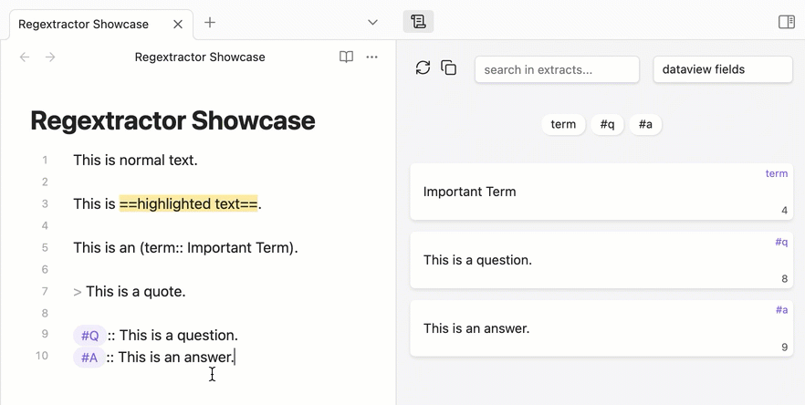

# Obsidian Regextractor

This plugin allows for browsing special parts of a file in Obsidian. Parts are identified by a specific syntax, e.g. Dataview Fields are usually written like `[key:: value]` or `(key:: value)`. The same goes for other text elements.

The Regextractor plugin allows for extracting these text parts and displaying them in a side panel. Each extract is displayed as a card and can be filtered by type, label and search string.

## Display Types
### Regular Cards
Regular cards show the text of the extract, the type and the corresponding line number. Clicking on the line number jumps to the corresponding position in the active document. **Right-Klick** on a regular card removes it from the list until the next refresh.



### Front and Back Cards
Front and Back Cards show text in the front and back of the card. When clicking on the card, the card turns around.


## Extract Types

Depending on what you want to extract, there are different typess.

### Dataview Fields
Fields that are written like `(key:: value)`, `[key:: value]` or `key:: value`.



### Highlighted Text
Text between two `==`.

### Question and Answers
The current syntax for questions and answers is:

```
#Q:: Question
#A:: Answer
```



### Comments
Text between two `%%`.

### Callouts
Text in Obsidian callouts, e.g. 
```
> [!info] Callout Title
This is a callout 
```

### Key-value-pairs

Currently only for Synonyms of this syntax:
```
#Synonym WTO = World Trade Organization
```

In this example, "WTO" will be shown on the front side and "World Trade Organizaion" on the back.

### Tasks

Elements, that start wirh `- [ ]`. If used with specific symbols (e.g. in Minimal Theme) like `- [?]`, they are filterable.

### Quotes

Markdown Quotes starting with `>`.

### Paragraphs

Currently lines of text which end with a tag. The entire line gets parsed and is filterable by the tag.
Example:
```
This is a long line with important information. #important
```

## Why this plugin?
I usually "annotate" my notes with many symbools (e.g. Dataview Fields, Highlights, Flashcards etc.). For large files, these are difficult to overview.

## Roadmap
- [ ] Set relevant Regex Types in Settings (to not show all available types in the dropdown menu)
- [ ] Filter out overlapping matches (e.g. "Callouts", which are also visible in "Quotes")
- [ ] Define custom regex types
- [ ] Allow filtering of files in entire vault, not just active file

## Known Bugs
- Overlapping matches: Callouts also start with a ">" character, just like quotes, and are therefore matched multiple times.
- Multiple Links in Dataview Fields don't get parsed correctly.

## Disclaimer
This plugin is in early development. Please make sure to backup your vault when using it.